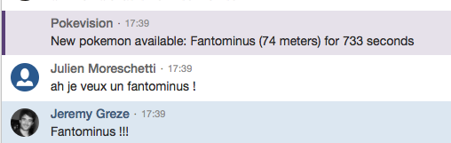

# PokemonGo-Hipchat

Get notifications in an Hipchat room when new Pokémons are available around a defined location. Based on [Pokevision.com](https://pokevision.com/) data.



Easy to adapt to any other notification system (Slack, ...).

## Installation

Clone the repository, verify that you have `requests` library install.

Change the variables in the heading of the python script:

```python
LATITUDE = 48.8708161
LONGITUDE = 2.3472812
HIPCHAT_API_KEY = 'xxxxxxxx'
HIPCHAT_ROOM = 'PokemonGo'
LOCALE = 'fr'
MAX_DISTANCE = 70 #meters
CACHE_FILE = os.path.join(dir, 'cache.json')
POKEMON_IDS_TO_FILTER = [13, 16, 19, 21, 41]
```

Then, set-up a cron to run the script every minute:

```
* * * * * /usr/bin/python /home/.../PokemonGoHipchat.py  >> /home/.../PokemonGoHipchat.log 2>&1
```

Tested only with Python 2.7.